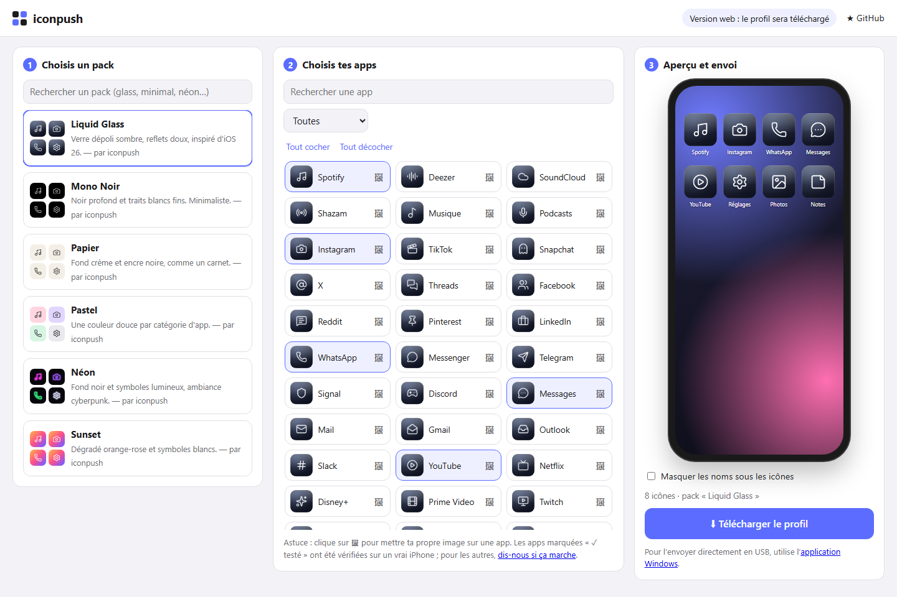

<div align="center">

# iconpush

**Custom iPhone home screen icons. No jailbreak, no Shortcuts banner.**
Plug your iPhone in, pick an icon pack, click *Send*. Done.



**[⬇ Download for Windows](https://github.com/MattRvfl/iconpush/releases/latest)** · **[🌐 Web version](https://mattrvfl.github.io/iconpush/)** · **[📖 Guide (FR)](docs/GUIDE.fr.md)** · **[🎨 Make a pack](docs/PACKS.md)**

</div>

## Why?

The usual trick to change an app icon on iPhone uses the **Shortcuts** app: it works, but every tap flashes a "Shortcuts" banner, and you have to build each icon by hand, one by one.

iconpush uses a different, official iOS mechanism: **configuration profiles** with **Web Clips** pointing at the app's URL scheme (`spotify://`, `instagram://`…). One file installs all your icons at once.

| | Shortcuts trick | iconpush |
| --- | --- | --- |
| Banner on every launch | yes | no\* |
| 30 icons | 30 × manual setup | one click |
| Share your setup | ✗ | send the profile or the pack |
| Jailbreak | no | no |

\* depends on the iOS version — see [Compatibility](#compatibility).

## Features

- 📲 **USB push** (Windows app): detects your iPhone, lists the apps **actually installed on it**, and sends the profile directly.
- 🎨 **Icon packs**: Liquid Glass, Mono Noir, Paper, Pastel, Néon, Sunset… generated for 50+ apps, and community packs are fetched from this repo.
- 🖼 **Your own images** for any app.
- 👀 **Live preview** of your home screen.
- 🙈 **Hide labels** for a clean, text-free home screen.
- 🌐 **Web version**: no install, downloads the `.mobileconfig` instead.
- 🔒 **Local & private**: nothing is uploaded anywhere. The desktop app only listens on `127.0.0.1`.

## Quick start

1. Install **Apple Devices** from the Microsoft Store (or iTunes) so Windows can talk to iPhones.
2. Download **[iconpush.exe](https://github.com/MattRvfl/iconpush/releases/latest)** and run it. Your browser opens.
3. Plug in your iPhone, unlock it and tap **Trust**.
4. Pick a pack and your apps, then click **Send**.
5. On the iPhone: **Settings → Profile Downloaded → Install**.

To remove everything: **Settings → General → VPN & Device Management → iconpush → Remove Profile**.

## Compatibility

| | |
| --- | --- |
| Windows | 10 / 11 (x64), with Apple Devices or iTunes |
| iPhone | iOS 14 or later |
| macOS / Linux | use the [web version](https://mattrvfl.github.io/iconpush/) for now |

Good to know:

- iOS doesn't let any tool **replace** an app's original icon without a jailbreak. iconpush **adds** new icons; hide the originals in the App Library.
- A profile pushed over USB still has to be accepted on the phone (*Profile Downloaded → Install*). Only supervised (company-managed) devices can skip that.
- iOS shows the profile as *Not Verified* because it isn't signed. That's expected.
- Each app entry in [`apps.json`](web/data/apps.json) has a `verified` flag: `false` means nobody has confirmed the URL scheme on a real device yet. Tested one? Open a PR!

## How it works

```
iconpush.exe ──HTTP (127.0.0.1)──▶ browser UI (packs, preview, icon rendering)
     │
     └──usbmuxd (Apple Mobile Device Service)──▶ iPhone
          ├─ lockdown          pairing / "Trust this computer"
          ├─ installation_proxy  list of installed apps
          └─ MCInstall          "InstallProfile" → Settings › Profile Downloaded
```

- The UI renders each icon on a `<canvas>` and builds the `.mobileconfig` (one `com.apple.webClip.managed` payload per icon).
- The Rust app is built on [`idevice`](https://crates.io/crates/idevice), a pure-Rust implementation of Apple's device protocols, plus a small `MCInstall` client ([`src/mcinstall.rs`](src/mcinstall.rs)).
- The exact same UI is published as the web version.

## Build from source

```bash
git clone https://github.com/MattRvfl/iconpush
cd iconpush
cargo build --release      # → target/release/iconpush.exe
```

## Contributing

The easiest and most useful contributions:

- **Test an app** and set `"verified": true` in [`web/data/apps.json`](web/data/apps.json).
- **Add an app** you use (URL scheme + bundle id).
- **Make a pack**: see [docs/PACKS.md](docs/PACKS.md).

See [CONTRIBUTING.md](CONTRIBUTING.md).

## Credits

Glyphs from [Lucide](https://lucide.dev) (ISC license). Device protocols via [idevice](https://github.com/jkcoxson/idevice).
iconpush is not affiliated with Apple. App names belong to their respective owners; packs never include their logos.

## License

[MIT](LICENSE)
